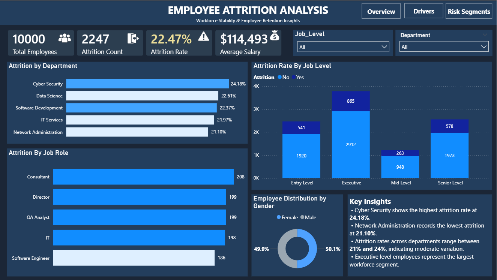
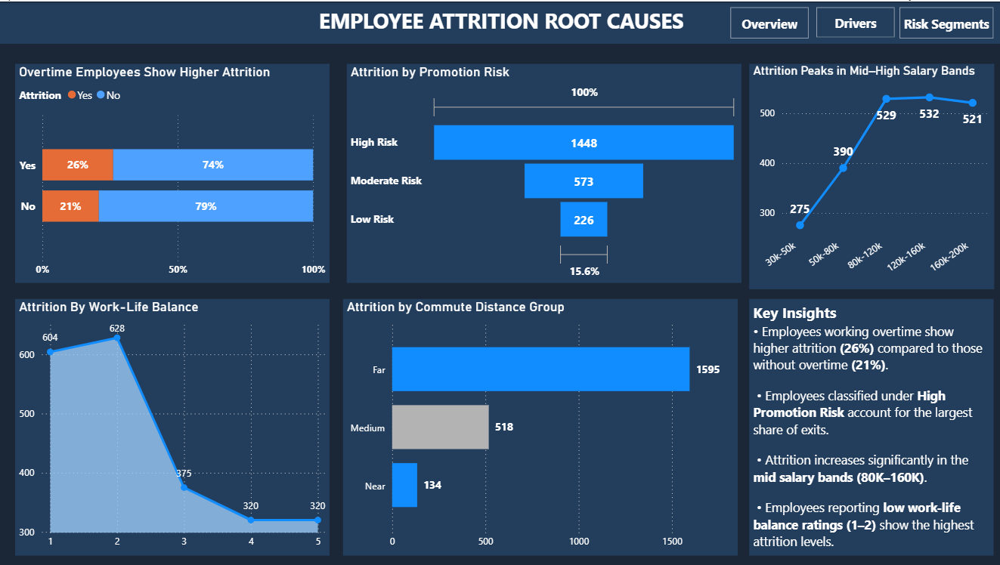
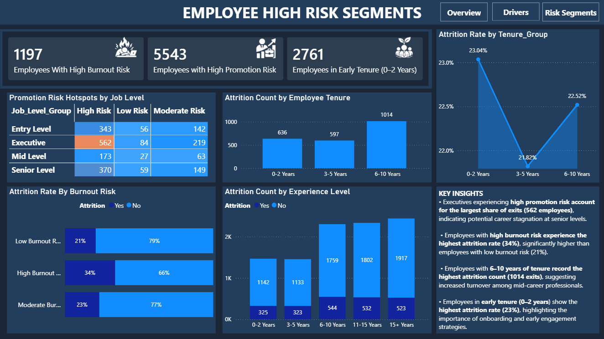

# Employee-Workforce-Attrition-Analysis

# 💼 Project Overview
An interactive Power BI dashboard designed to analyze employee attrition patterns within an organization. The dashboard helps HR teams identify attrition hotspots, understand the key drivers behind employee turnover, and detect high-risk employee segments requiring retention strategies.

# 📌 Business Problem

Employee attrition is a major challenge for organizations because high turnover leads to:

• Increased hiring and training costs
• Loss of experienced talent
• Reduced productivity and team stability

However, HR teams often struggle to identify why employees leave because workforce data is scattered across multiple systems.

Key questions organizations need answers to:

• Which departments have the highest attrition?
• Are entry-level employees leaving more frequently?
• Does overtime or burnout increase attrition risk?
• Are promotion stagnation and salary bands influencing exits?
• Do commute distances affect employee retention?

# 🎯 Goal of the Dashboard

The objective of this dashboard is to provide a data-driven view of workforce attrition that helps organizations:

• Identify departments and roles with the highest turnover
• Detect employee groups at high risk of leaving
• Understand workplace factors influencing attrition
• Support HR teams in building retention strategies
• Enable data-driven workforce planning

# 🛠 Tech Stack

The dashboard was built using the following tools and technologies:

• 🗄 SQL – Used for querying, cleaning, and preparing workforce data.
• 📊 Power BI Desktop – Main platform used for creating the interactive dashboard.
• 🔄 Power Query – Used for transforming and shaping the dataset.
• 🧠 DAX (Data Analysis Expressions) – Used to calculate measures such as attrition rate, employee counts, and workforce risk indicators.

# 📂 Data Source & Overview

The dataset used in this project was sourced from Kaggle.

Dataset: HR Employee Attrition Dataset
Source: Kaggle

🔗 Dataset Link:
[https://www.kaggle.com/datasets/ankitrajmishra/hr-attrition-dataset]

The dataset contains approximately 10,000 employee records with workforce attributes related to employee retention and attrition analysis.

Key fields included in the dataset:

• Employee ID
• Department
• Job Role
• Job Level
• Age Group
• Salary Band
• Work-Life Balance Rating
• Burnout Risk
• Promotion Risk
• Commute Distance
• Tenure Group
• Experience Level
• Attrition Status

# 📖 What’s Inside
This repository includes a PDF version of the Power BI report hosted on the Power BI Service. Use the link below for a quick preview.

• [Dashboard As PDF](https://github.com/Pratraw18/employee-workforce-attrition-analysis-sql-powerbi/blob/main/Dashboard%20As%20PDF.pdf)

# 📷 Dashboard Preview
## Dashboard Preview

# 📊 Business Impact & Key Insights

Key insights uncovered through the analysis include:

• Cyber Security shows the highest attrition rate (24.18%) among departments.

• Employees working overtime show higher attrition (26%) compared to employees without overtime.

• Employees with low work-life balance ratings (1–2) experience the highest attrition levels.

• Attrition increases significantly among employees in mid-level salary bands (80K–160K).

• Employees in early tenure stages (0–2 years) show the highest attrition rate.

• Employees with high burnout risk experience attrition rates as high as 34%.

These insights can help organizations develop targeted retention strategies and improve employee satisfaction.

# 📈 Recommended Retention Strategies
🏢 1. Department-Level Retention Strategy

Insight:
Cyber Security has the highest attrition rate (24.18%).

Retention Strategy:

• Conduct role-specific salary benchmarking for cybersecurity professionals because market demand is very high.
• Introduce retention bonuses or skill-based incentives for critical security roles.
• Provide career progression paths such as security architect or security leadership tracks.
• Reduce burnout by improving team staffing and workload distribution.

Impact:
Helps retain highly skilled talent in competitive roles.

⏱ 2. Overtime Management Strategy

Insight:
Employees working overtime show higher attrition (26%).

Retention Strategy:

• Implement overtime monitoring dashboards for HR and managers.
• Introduce flexible working hours or hybrid work policies.
• Ensure overtime is compensated with either pay or additional leave.
• Identify teams with excessive overtime and hire additional staff or redistribute workload.

Impact:
Reduces employee burnout and improves work-life balance.

🏡 3. Improve Work-Life Balance Programs

Insight:
Employees with low work-life balance ratings (1–2) have the highest attrition.

Retention Strategy:

• Introduce mental health support programs.
• Provide flexible work schedules.
• Offer wellness benefits like gym memberships or counseling.
• Conduct regular employee engagement surveys.

Impact:
Improves job satisfaction and reduces stress-driven exits.

💰 4. Salary Band Adjustment Strategy

Insight:
Attrition peaks in mid-level salary bands (80K–160K).

Retention Strategy:

• Perform market salary benchmarking for mid-level employees.
• Introduce performance-based salary increments.
• Provide long-term incentives or stock options for mid-level professionals.
• Offer clear career progression paths to senior roles.

Impact:
Prevents mid-career professionals from leaving for better-paying opportunities.

👶 5. Early Tenure Employee Retention

Insight:
Employees in 0–2 years tenure show the highest attrition.

Retention Strategy:

• Implement structured onboarding programs.
• Assign mentors or buddy systems for new employees.
• Conduct regular check-ins during the first year.
• Provide training and career development programs early in employment.

Impact:
Improves employee engagement during the critical early employment stage.

🔥 6. Burnout Risk Reduction

Insight:
Employees with high burnout risk show attrition rates up to 34%.

Retention Strategy:

• Monitor employee workloads using HR analytics dashboards.
• Encourage mandatory time-off policies.
• Implement employee wellness programs.
• Train managers to recognize burnout signals early.

Impact:
Reduces stress-related resignations and improves workforce stability.

# Links
## 🔗 Live Dashboard

📊[Live Dashboard](https://app.powerbi.com/view?r=eyJrIjoiYTNlMmY0Y2ItYzY3Yy00ZDExLTgxZTYtOTc1NzZiOGEyMDRjIiwidCI6ImVjMTU1NWRlLTlmMDAtNDQ1OS05MDA3LTUxNDc2NDQ3MDIwNyJ9)

